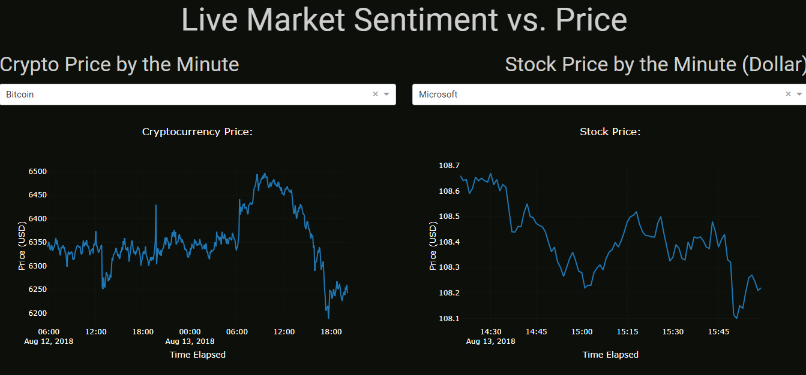
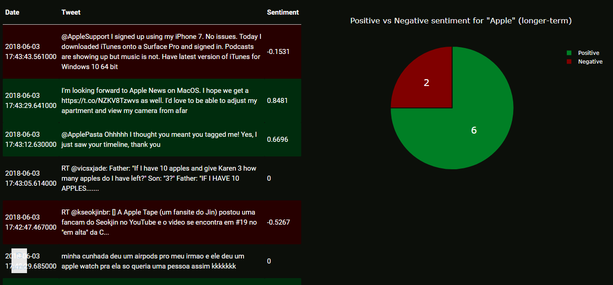

# StockAnalysis

This project tracks live price data of 5 different stocks and cryptocurrencies through AlphaVantage. It also performs Twitter sentiment analysis to determine the ratio of positive to negative messages about the company in real time. The purpose of this project is to use sentiment analysis to guage the market and hopefully earn a profit. 

Price Data

Company Sentiment

Tweet Stream 

